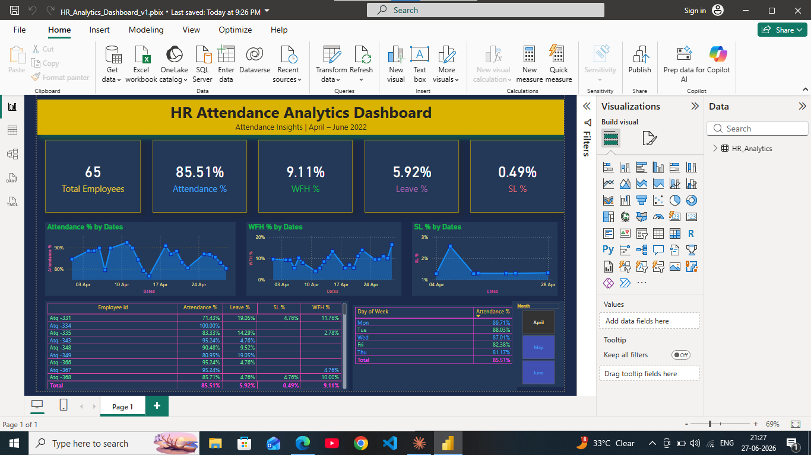

#  HR Attendance Analytics Dashboard | AtliQ Company

##  Project Overview
This project analyzes **employee attendance data** of AtliQ company for **April–June 2022**.
The goal is to help the HR team track attendance patterns, work-from-home trends, and sick leave behavior using an interactive Power BI dashboard.

---

##  Tools Used
| Tool | Purpose |
|------|---------|
| Microsoft Excel | Data cleaning & transformation using Power Query |
| Power BI | Dashboard creation & data visualization |

---

##  Dataset
- **Source:** AtliQ Company HR Attendance Sheet (2022–2023)
- **Period:** April 2022 – June 2022
- **Rows:** 6,492 records (after transformation)
- **Columns:** Employee ID, Name, Date, Attendance Status

### Attendance Codes
| Code | Meaning |
|------|---------|
| P | Present |
| WFH | Work From Home |
| SL | Sick Leave |
| PL | Paid Leave |
| ML | Menstrual Leave |
| BL | Birthday Leave |
| FFL | Floating Festival Leave |
| BRL | Bereavement Leave |
| LWP | Leave Without Pay |
| WO | Weekly Off |
| HO | Holiday Off |

---

##  Data Transformation (Excel Power Query)
1. Imported 3 monthly sheets (April, May, June) separately
2. Promoted headers & removed garbage rows
3. **Unpivoted** date columns — Wide Format → Long Format
4. Filtered out summary rows (Total Present Days, etc.)
5. Renamed columns: `Dates`, `Attendance`
6. **Appended** all 3 tables into one final table: `HR Analytics` (6,492 rows)

---

##  DAX Measures Created
```dax
Attendance % = DIVIDE([Present Days], [Total Days], 0)
WFH % = DIVIDE([WFH Days], [Total Days], 0)
SL % = DIVIDE([SL Days], [Total Days], 0)
Leave % = DIVIDE([Leave Days], [Total Days], 0)
Total Employees = DISTINCTCOUNT('HR_Analytics'[Employee id])
Present Days = CALCULATE(COUNTROWS('HR_Analytics'), 'HR_Analytics'[Attendance] = "P")
```

---

##  Dashboard Features
- **KPI Cards** — Total Employees, Attendance %, WFH %, Leave %, SL %
- **Line Charts** — Attendance %, WFH %, SL % trends over time
- **Month Slicer** — Filter by April, May, June
- **Employee Metrics Table** — Individual attendance breakdown
- **Day of Week Analysis** — Attendance pattern by weekday

---

##  Key Insights
-  **Overall Attendance** is **85.51%** across 3 months
-  **WFH %** is **9.11%** — significant remote work trend
-  **Sick Leave %** is **0.49%** — relatively low
-  **Monday & Tuesday** have highest attendance (89–88%)
-  **Friday** has lowest attendance (**82.38%**) — weekend effect
- Some employees show **100% attendance** — highly dedicated workforce

---

##  Dashboard Screenshot


---

## Files in this Repository
| File | Description |
|------|-------------|
| `HR_Analytics_Dashboard_v1.pbix` | Power BI Dashboard file |
| `project_ishika.xlsx` | Cleaned Excel file with Power Query |
| `dashboard_screenshot.png` | Final dashboard screenshot |
| `README.md` | Project documentation |

---

##  About Me
**Ishika** | BCA Student | Aspiring Data Analyst

